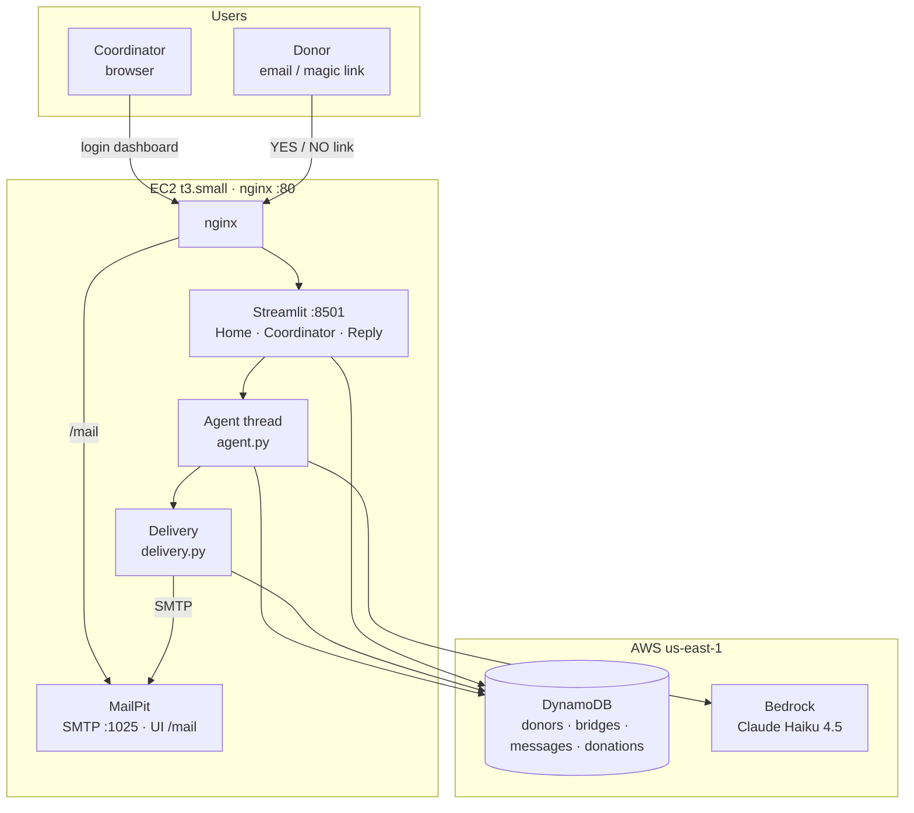
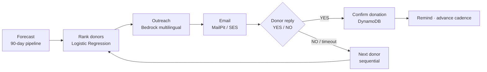
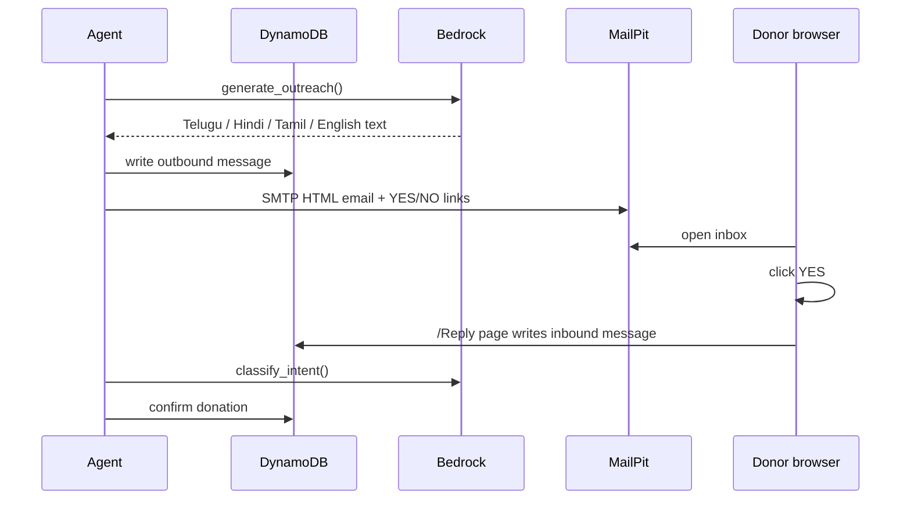

# Spandan — Architecture

Simple overview of the live system at **http://98.84.159.117** (EC2 + nginx).

---

## 1. System overview



---

## 2. Autonomous agent loop



**Modes**
- **Normal** — one donor at a time per patient (`DONOR_WAIT_SECONDS`)
- **Surge** — emergency parallel blast to top-ranked donors

---

## 3. Email & reply flow



---

## 4. ML & rules (who to contact)

| Step | Type | Module |
|------|------|--------|
| When is blood needed? | Cadence math | `forecasting.py` |
| Blood type match? | Rules | `ranking.py` COMPATIBILITY |
| Who responds best? | ML — Logistic Regression | `ranking.py` |
| What to say? | LLM — Bedrock Haiku | `bedrock_chat.py` |

---

## 5. DynamoDB tables

| Table | Purpose |
|-------|---------|
| `donors` | Donor profile, ML features, skip_score |
| `bridges` | Patient, cadence, donor_pool |
| `messages` | Inbound / outbound emails |
| `donations` | Confirmed donations |
| `agent_log` | Audit trail of every agent action |

---

## 6. Deploy path

```
GitHub repo → EC2 clone → ec2-setup.sh
  → train ranking model → load Dataset.csv → DynamoDB
  → nginx :80 → systemd spandan.service → run-stack.sh
```

Live URLs: **Dashboard** http://98.84.159.117 · **MailPit** http://98.84.159.117/mail · **Bitly** https://bit.ly/4vCaAQ4
